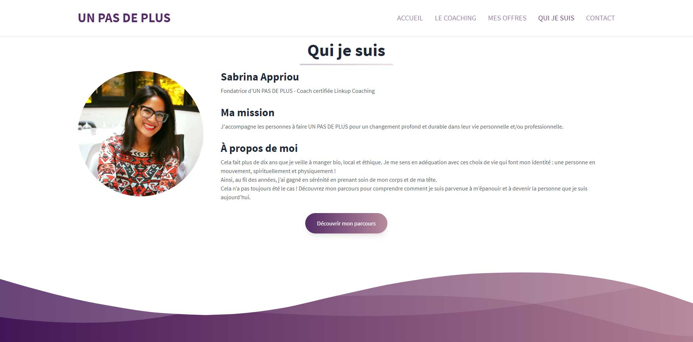

<!-- PROJECT LOGO -->

  <!--  -->

  <h3 align="center">UN PAS DE PLUS website project</h3>

  

    A website that presents the activity of Sabrina Appriou, personal development coach, founder of Un Pas De Plus.
     
    <a href="https://github.com/sabrinaappriou/unpasdeplus/issues">🐛 Report Bug</a>
  

<!-- TABLE OF CONTENTS -->

  
Table of Contents

  <ul>
    <li>
      <a href="#about-the-project-">About The Project 👈</a>
      <ul>
        <li><a href="#preview">Preview</a></li>
        <li><a href="#build-with">Build with</a></li>
      </ul>
    </li>
    <li><a href="#contact-">Contact 📧</a></li>
  </ul>

<!-- ABOUT THE PROJECT -->

## About The Project 👈

### Preview

### Build with

The main structure of this project is built with [Next.js](https://nextjs.org/), a React framework.

The layout is based on a free template from [Tailwind Awesome](https://www.tailwindawesome.com/resources/landing-page), which use the CSS framework [Tailwind CSS](https://tailwindcss.com/). The **CSS** has been customized with the help of [SASS](https://sass-lang.com/).

The website is currently tested on a [Vercel](https://vercel.com/) deployment. You can see the result at [UN PAS DE PLUS](https://unpasdeplus.vercel.app/).

Soon it will have its own domain 😎 !

<!-- CONTACT -->

## Contact 📧

Antoine Bollinger - [LinkedIn](https://www.linkedin.com/in/antoinebollinger/) - antoine.bollinger@gmail.fr